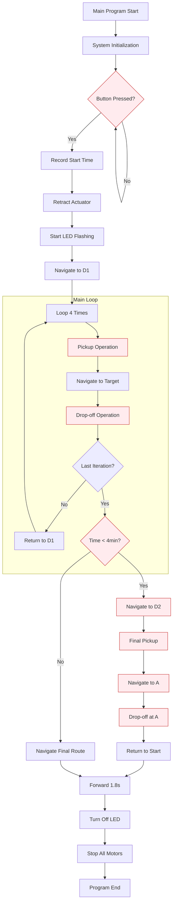

```mermaid
graph TD
    A[Main Program Start] --> D[System Initialization]
    D --> E{Button Pressed?}
    E -->|No| E
    E -->|Yes| F[Record Start Time]
    F --> G[Retract Actuator]
    G --> H[Start LED Flashing]
    H --> I[Navigate to D1]
    I --> J[Loop 4 Times]
    
    subgraph Main Loop
        J --> K[Pickup Operation]
        K --> L[Navigate to Target]
        L --> M[Drop-off Operation]
        M --> N{Last Iteration?}
        N -->|No| O[Return to D1]
        N -->|Yes| P{Time < 4min?}
        O --> J
    end
    
    P -->|Yes| Q[Navigate to D2]
    Q --> R[Final Pickup]
    R --> S[Navigate to A]
    S --> T[Drop-off at A]
    T --> U[Return to Start]
    
    P -->|No| V[Navigate Final Route]
    
    U --> W[Forward 1.8s]
    V --> W
    W --> X[Turn Off LED]
    X --> Y[Stop All Motors]
    Y --> Z[Program End]
    
    classDef critical fill:#ffebee,stroke:#c62828;
    class E,K,M,P,Q,R,S,T critical;
```

